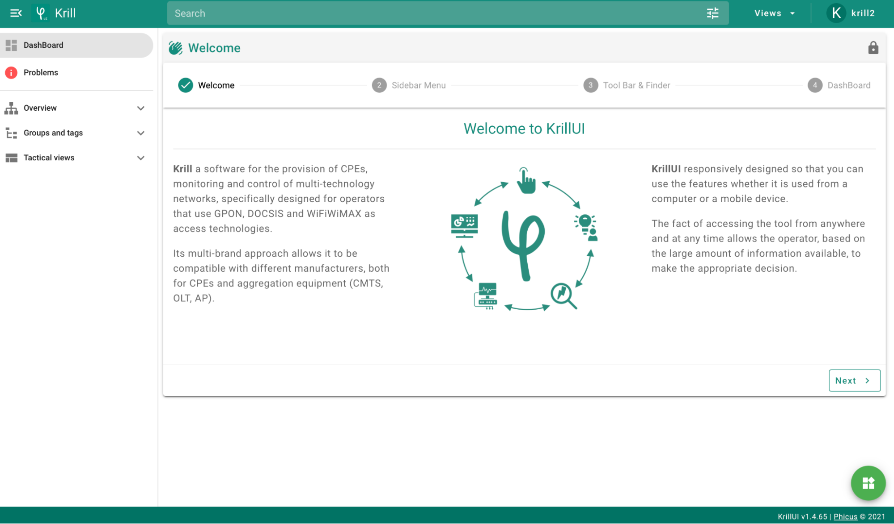
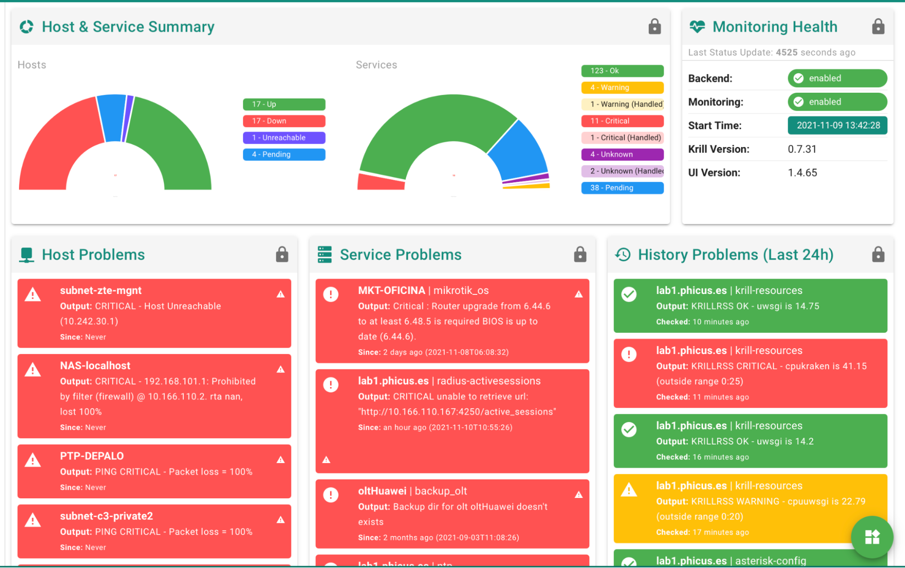
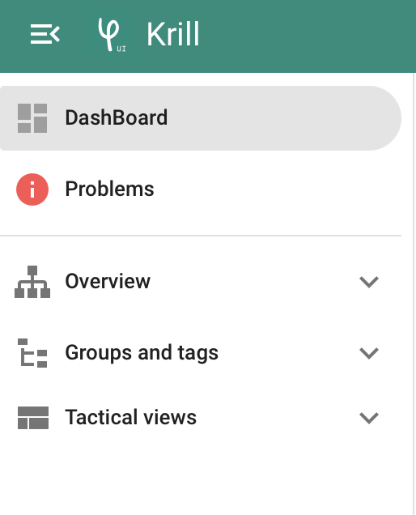

# DashBoard

Cuando se loguea el usuario por primera vez en la interfaz web se muestra una ventana como la siguiente:

En ella aparece una breve bienvenida a la nueva interfaz web y ofrece al usuario una pequeña guía de uso de KrillUI.

## Widgets por defecto

La vista principal es aquella en la que se muestra la información de interés. Según el tipo de  vista seleccionada mostrará una información u otra. Permite mostrar tanto un resumen general de la red, como la información de un host específico. 

## Widgets personalizados

El menú del panel lateral incluye una serie de accesos directos a vistas o fichas de interés. 

Este menú da un acceso rápido a problemas de red, así como diferentes filtros rápidos (dentro del submenú Overview) para localizar los diferentes recursos que se encuentran en él.

También se puede acceder a las Vistas tácticas (Tactical Views) que nos permiten visualizar y organizar la información de diferentes elementos de la red: Matrix, Trivial, ONUs pendientes de provisión, sesiones Radius, etc.

