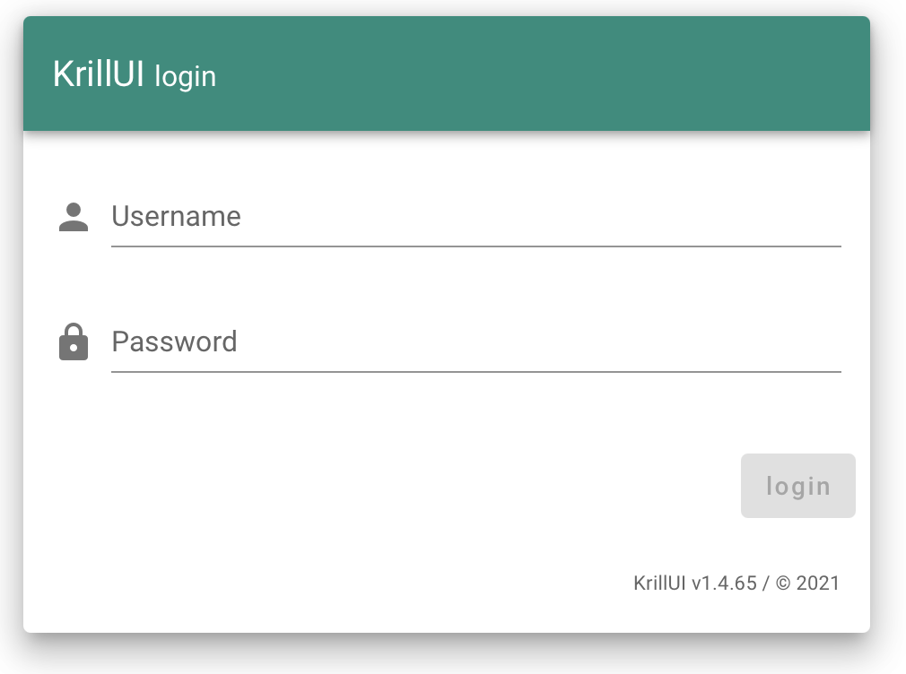

# Login

La interfaz web de ***Krill2*** (KrillUI) hace uso del protocolo HTTPS y se accede mediante el siguiente enlace:
- [https://XXX.phicus.es/login](https://XXX.phicus.es/login)

Donde **XXX** representa las 3 siglas del operador asignadas por el equipo de Phicus.

En Krill2 se ha unificado la gestión de usuarios y las credenciales de acceso, son las mismas que las credenciales de acceso a Kiwi, la plataforma de gestión. 
En el caso de no disponer de un acceso a Kiwi/Krill2, se puede solicitar la creación de un usuario mediante el canal de Slack o desde otra cuenta de Kiwi con permisos de gestión de usuarios. 

- ***Username***: el nombre de usuario de Kiwi.
- ***Password***: la contraseña de usuario de Kiwi.

